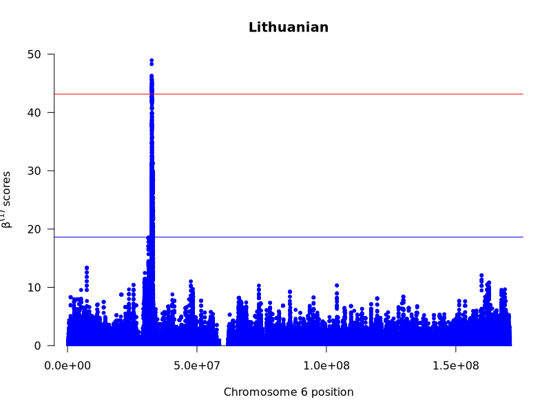

[](LICENSE)
[](https://github.com/xin-huang/Lithuanian-archaic-introgression/actions)

# Lithuanian-archaic-introgression

## Introduction

This repository contains a Snakemake workflow designed to reproduce the results of a scan for candidates of adaptive introgression and balancing selection on chromosome 6 in Lithuanian genomes. The workflow has been tested on Oracle Linux 9 using the Life Science Compute Cluster at the University of Vienna.

## Usage

1. Install [Mambaforge (version: 23.3.1)](https://github.com/conda-forge/miniforge/releases/download/23.3.1-1/Mambaforge-23.3.1-1-Linux-x86_64.sh).

2. Clone this repository:

```
git clone https://github.com/xin-huang/Lithuanian-archaic-introgression
cd Lithuanian-archaic-introgression
```

3. Create the environment:

```
mamba env create -f workflow/envs/env.yaml
```

4. Activate the environment:

```
mamba activate lai
```

5. Run the analysis locally:

```
snakemake -c 1 --use-conda
```

6. Run the analysis on HPC:

```
snakemake -c 1 --use-conda --profile config/slurm
```

Users should adjust the resource parameters in each Snakemake file to match their cluster settings and modify the `config.yaml` file in `config/slurm` to suit their job scheduler.

## Results

Distribution of adaptive introgression probabilities on chromosome 6 in Lithuanian genomes using MaLAdapt (Zhang et al. 2023).


Manhattan plot of B1 scores on chromosome 6 in Lithuanian genomes using BetaScan (Siewert and Voight 2017).



## References

- Siewert and Voight. 2017. *Mol Biol Evol* **34**: 2996–3005.

- Zhang et al. 2023. *Mol Biol Evol* **40**: msad001.
